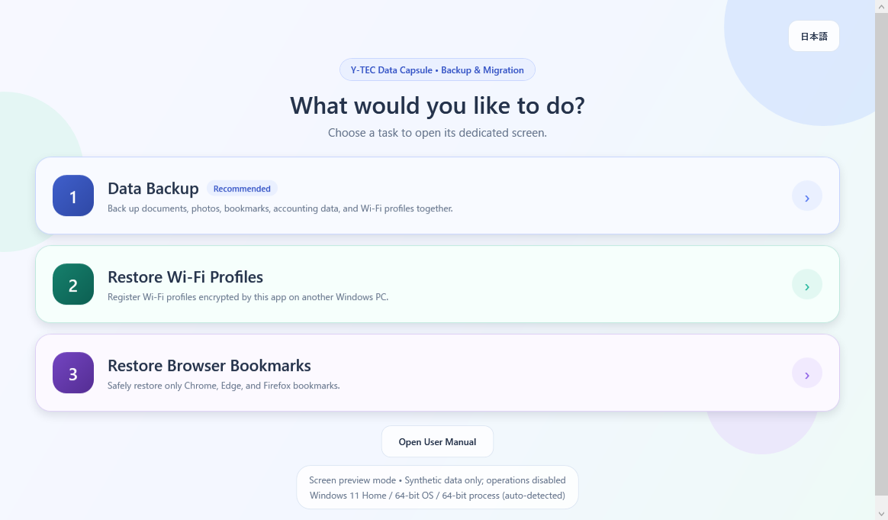

# Y-TEC Data Capsule

[日本語README](README.md)

Y-TEC Data Capsule is a portable Windows app for collecting user data from a
Windows PC or a detached Windows drive into a newly created backup folder on a
different drive. Backup items are maintained in a validated JSON catalog.

Version 1.2.0 is republished on 2026-09-29 under Apache-2.0 with Y-TEC self-signing.
This is not a Microsoft- or commercial-CA-trusted signature; SmartScreen warnings
may appear. Certificates are never installed automatically.
Accounting-data detection and copying have been verified with
synthetic data; always prefer each accounting product's official backup and
restore procedure.

## Official distribution

- Product page and downloads: https://ytec.cloudfree.jp/forge/en/projects/data-capsule/
- Source repository: https://github.com/ytec-forge-commits/ytec-data-capsule
- Final ZIP, bilingual PDF, and public certificate hashes: `SHA256SUMS-data-capsule-1.2.0-republish-20260929.txt` in GitHub Releases
- Contact: https://ytec.cloudfree.jp/forge/contact/

No Store edition is currently published. Update manually into a separate folder,
keeping existing backups and the previous folder. The official Wi-Fi compatibility
input and saved formats are unchanged. Old history, binaries, and ZIPs are not
republished; downloads are freshly built from the current source.

## Three dedicated modes

1. **Data Backup**
   - Select basic data, browser bookmarks, accounting data, and Wi-Fi profiles.
   - Select all items, an entire group, or individual items.
   - Create a new user-named folder under the selected destination.
   - Review the file count, planned size, warnings, and ACL behavior first.
2. **Restore Wi-Fi Profiles**
   - Select the top-level backup folder and let the app locate its encrypted
     Wi-Fi container automatically.
3. **Restore Browser Bookmarks**
   - Select the top-level backup folder and let the app locate bookmark backups.
   - The relevant browsers close automatically before restore.
   - Chrome and Edge bookmarks are rolled back before replacement.
   - Firefox uses its official Restore > Choose File flow.

Passwords, cookies, browsing history, and sessions are never included in the
browser-bookmark backup or restore scope.



## Supported environment

- Windows 7 SP1, 8, 8.1, 10, and 11
- 32-bit and 64-bit Windows
- .NET Framework 4.6.1 or later
- One AnyCPU portable build that runs as a 32-bit process on x86 Windows and a
  64-bit process on x64 Windows

Wi-Fi containers, bookmarks, accounting data, and ordinary files use formats
that do not depend on CPU bitness. Cross-architecture migration in either
direction is supported by design. Windows 7, 8, 8.1, and .NET Framework 4.6.1
are no longer serviced by Microsoft; compatibility here means that the app can
technically run, not that the operating system remains supported.

## Backup behavior and safety boundaries

- Source data is never deleted, moved, renamed, or modified.
- Existing backup folders are never reused or overwritten.
- The source drive list includes only drives with a root-level `Windows` folder.
- The app creates a read-only plan before copying.
- Copy concurrency is tuned from 2 to 12 workers based on CPU and storage.
- Locked files can be read through a VSS snapshot fallback.
- OneDrive and iCloud placeholders are not hydrated automatically. Only locally
  available files are copied; online-only files are counted and skipped.
- Reparse points are not followed.
- NTFS and ReFS output created by the current run receives owner `Everyone` and
  inheritable full-control ACLs after the backup completes.
- exFAT backups are allowed, but exFAT cannot store Windows owners or ACLs. The
  limitation is shown before copying and written to the manifest.
- FAT32 destinations are rejected before copying.
- Cancellation keeps already copied output and records the final state in the
  versioned JSON manifest.
- The app performs no telemetry, analytics, cloud sync, or update checks.

The normal executable requests administrator privileges at startup because
NTFS/ReFS ACL finalization needs elevation. Standard users can start it by
entering administrator credentials in the Windows UAC prompt.

## Browser bookmarks

- Chrome: `Bookmarks` and `Bookmarks.bak` in each profile
- Microsoft Edge: `Bookmarks` and `Bookmarks.bak` in each profile
- Firefox: `.jsonlz4` and `.json` files under `bookmarkbackups`
- Internet Explorer: the legacy `Favorites` folder

Before backup or restore, the app asks matching browser processes to exit and
terminates remaining background processes after six seconds. Only executables
whose full paths match known installation locations are targeted. Chrome and
Edge restore creates rollback copies under
`%LOCALAPPDATA%\Y-TEC\WindowsBackup\bookmark-restore-rollbacks`.

## Thunderbird and Apple MobileSync

Thunderbird mail, account settings, address books, and filters are included.
Password databases, cookies, and session state are excluded. Restore with
Thunderbird's official import or profile-migration procedure and re-enter
passwords on the destination PC.

Apple device backups are detected in both locations used by desktop iTunes and
the Microsoft Store app:

- `AppData\Roaming\Apple Computer\MobileSync`
- `<user profile>\Apple\MobileSync`

The offline HTML/PDF manuals explain how to place these backups on the new PC
and validate them in Apple Devices or iTunes.

## Wi-Fi profile encryption

`netsh wlan export profile key=clear` creates temporary XML. The app validates
that XML and immediately protects it with AES-256-CBC plus HMAC-SHA-256 using
Encrypt-then-MAC. Plaintext XML exists only in an app-owned temporary directory
whose ACL is limited to the current user, SYSTEM, and Administrators. It is
deleted on success and narrowly cleaned on the next launch after a crash.

The official Y-TEC build embeds a non-public compatibility key to support
transfer to another PC without a user password. This prevents casual plaintext
exposure but does not guarantee confidentiality against detailed executable
analysis.

Public-source builds use an explicitly labeled public development key and are
not compatible with official Y-TEC Wi-Fi backups. Do not use public development
builds for real Wi-Fi credentials. Maintainers can provide their own 32-byte key
outside the repository with the `YtecDataCapsuleCustomKeyFile` MSBuild property.
The official key must never be committed, logged, or included in source
artifacts. See [CODE_SIGNING_POLICY.md](CODE_SIGNING_POLICY.md) and
`docs/security/00-wifi-encryption-boundary.md`.

## Postcard and accounting software

The catalog searches data candidates for Fudeoh, Fudegurume, Fudemame,
Rakuraku Hagaki, Atena Shokunin, Fudeyasume, Hagaki Studio, Hagaki Sakka, and
Hagaki Design Kit. Personal and Public address-book candidates are stored in
separate output trees. This includes Fudegurume's shared
`Public\Documents\みんなの筆ぐるめ` location.

Automatic accounting targets currently cover ordinary file-copy data for
Yayoi Accounting / Yayoi Blue Return and FreeWay Accounting. Products that
require an in-product backup command are intentionally excluded. These targets
have synthetic-data coverage but have not completed import acceptance with the
commercial applications, so vendor instructions take priority.

## Build and test

```powershell
& "C:\Program Files\dotnet\dotnet.exe" build .\Ytec.WindowsBackup.slnx -c Release
& .\tests\Ytec.WindowsBackup.Tests\bin\Release\net461\Ytec.WindowsBackup.Tests.exe
& .\eng\Test-Localization.ps1
```

Fixed-architecture verification must use `Rebuild` to avoid reusing an EXE from
the previous target:

```powershell
& "C:\Program Files\dotnet\dotnet.exe" build .\Ytec.WindowsBackup.slnx -t:Rebuild -c Release -p:PlatformTarget=x86
& "C:\Program Files\dotnet\dotnet.exe" build .\Ytec.WindowsBackup.slnx -t:Rebuild -c Release -p:PlatformTarget=x64
```

The screenshot pipeline builds with the non-elevating UI-test manifest and
uses synthetic data only:

```powershell
& .\eng\New-Screenshots.ps1 -ReplaceExisting
```

## Documentation

- `VALIDATION.md`: release gates, VM evidence, user acceptance, and limitations
- `docs/manual/index.html`: Japanese offline user manual
- `docs/manual/en/index.html`: English offline user manual
- `docs/architecture/00-target-architecture.md`: architecture and safety boundaries
- `docs/compatibility/00-windows-and-bitness.md`: OS and bitness compatibility
- `docs/security/00-wifi-encryption-boundary.md`: Wi-Fi threat model
- `docs/backup-items/00-browser-and-accounting.md`: browser and accounting rationale
- `docs/licensing/2026-08-26-public-release-audit.md`: public-release, license, and SignPath compatibility audit
- [VALIDATION.md](VALIDATION.md): public release gates, VM compatibility evidence,
  user acceptance, and explicitly excluded tests

## Privacy, security, and contributions

- [PRIVACY.md](PRIVACY.md)
- [SECURITY.md](SECURITY.md)
- [CONTRIBUTING.md](CONTRIBUTING.md)
- [CODE_SIGNING_POLICY.md](CODE_SIGNING_POLICY.md)
- [THIRD-PARTY-NOTICES.txt](THIRD-PARTY-NOTICES.txt)

## Code signing policy

The [Code signing policy](CODE_SIGNING_POLICY.md) documents team roles, manual
approval, controlled local official builds, and secret handling. Current direct
downloads use Y-TEC self-signing. The retained SignPath workflows are future
candidates, not proof of approval, configured secrets, or use for this release.
Verify the final package with `eng/Test-PortableRelease.ps1 -ZipPath <final ZIP>
-ExpectedSignature SelfSigned -PublicCertificatePath <public CER>`.
Windows SDK SignTool is required; use `-SignToolPath <SignTool path>` if it is not on PATH.

Y-TEC-owned source code, documentation, app-icon artwork, and screenshots are
licensed under the [Apache License 2.0](LICENSE.txt) unless stated otherwise.
Modification, commercial use, and redistribution are permitted under that
license. Modified builds must not imply Y-TEC approval or official status.

- Attribution: [NOTICE](NOTICE)
- Brand and official-status guidance: [BRAND_POLICY.md](BRAND_POLICY.md)
- Asset provenance: [ASSET_PROVENANCE.md](ASSET_PROVENANCE.md)
- Third-party terms: [THIRD-PARTY-NOTICES.txt](THIRD-PARTY-NOTICES.txt)

License information was last reviewed on 2026-08-26. Earlier distributed
versions may remain subject to the terms published with those versions; this
Apache-2.0 adoption is not retroactive. Product names, company names, and
trademarks belong to their respective owners.
