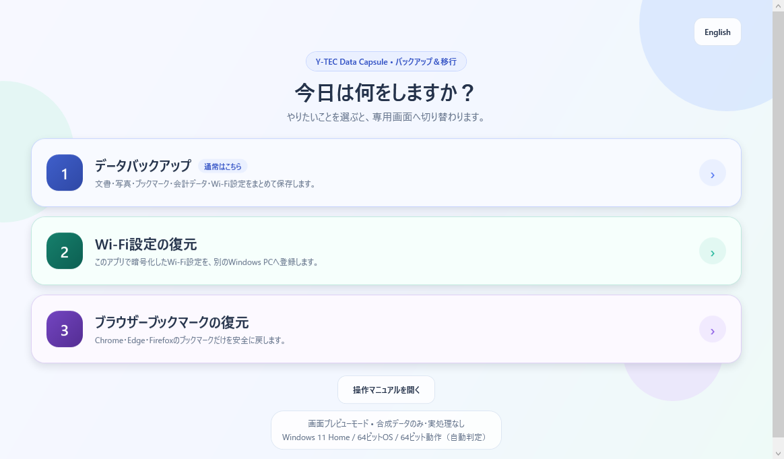

# Y-TEC Data Capsule

[English README](README.en.md)

Windows PCや取り外したWindowsドライブから、利用者データを別ドライブへ複製するポータブルアプリです。バックアップ項目を設定ファイルで保守できる新規設計です。

Apache-2.0の正式版 `1.2.0` を2026-09-29に再公開します。今回の直接配布版はY-TEC自己署名です。Microsoftや商用CAの信頼済み署名ではなく、SmartScreen等の警告が出る場合があります。証明書の自動登録は行いません。実会計ソフトでの読込受入はリリース判断により省略しています。会計データは合成データで検出・分類・コピーを確認済みですが、必ず各製品の公式バックアップ手順を優先してください。

## 公式配布

- 紹介・ダウンロード: https://ytec.cloudfree.jp/forge/projects/data-capsule/
- ソース・Release: https://github.com/ytec-forge-commits/ytec-data-capsule
- 最終ZIP・日英PDF・公開証明書のSHA-256: Releaseの `SHA256SUMS-data-capsule-1.2.0-republish-20260929.txt`
- お問い合わせ: https://ytec.cloudfree.jp/forge/contact/

Store版は未公開です。ポータブル版を新しいフォルダーへ展開して手動更新し、バックアップと旧フォルダーを保持してください。今回も公式Wi-Fi互換鍵と保存形式を変更していません。旧履歴・旧バイナリ・旧ZIPを再公開せず、現在のソースから作成した配布物を提供します。

## 起動時の3モード

1. **データバックアップ**
   - 基本データ、ブラウザーブックマーク、会計データ、Wi-Fi設定を選択して保存
   - 全項目・カテゴリ単位・個別項目の3段階で選択
   - 保存場所の下へ、利用者が入力した任意名の新規フォルダーを作成
   - コピー前に件数、容量、警告をプレビュー
2. **Wi-Fi設定の復元**
   - バックアップの一番上のフォルダーを選ぶと暗号化ファイルを自動検出し、別PCへ登録
3. **ブラウザーブックマークの復元**
   - バックアップの一番上のフォルダーを選ぶと対象ブックマークを自動検出
   - 実行前に対象ブラウザーを自動終了
   - Chrome / Edgeは復元前データを退避してから置換
   - Firefoxは公式の「復元 → ファイルを選択」手順を案内

パスワード、Cookie、閲覧履歴、セッションはブックマークのバックアップ・復元対象にしません。

iPhone / iPadのローカルバックアップは、デスクトップ版iTunesの
`AppData\Roaming\Apple Computer\MobileSync` と、Microsoft Store版の
`<ユーザーフォルダー>\Apple\MobileSync` の両方を探索します。

## 操作マニュアル

起動画面の［操作マニュアルを開く］から、EXEと一緒に配布する
`操作マニュアル\index.html`を既定ブラウザーで開けます。同じフォルダーへ
オフライン参照・印刷用の`Y-TEC Data Capsule 操作マニュアル.pdf`も同梱します。
会計データについては、実会計ソフトでの読込が未検証であること、メーカーまたは
販売店の公式バックアップ手順を優先することを両方のマニュアルへ明記しています。
Thunderbird、MobileSync、年賀状ソフト、会計ソフト、一般ファイルについて、
バックアップ後に利用者が手動で移行・復元する方法も案内します。

## 画面デザイン



- 淡いブルー、ミント、ラベンダーで3モードを色分け
- 角丸カード、大きめの操作ボタン、選択状態が見えるチェックボックス
- 重要なEveryone ACLや復元時の注意は黄色い警告カードで維持
- 1280×720を基準にし、720px幅では実行カードを縦に並べて表示
- 画像素材や外部UIライブラリを使わず、Windows 7互換のWPF標準描画だけで構成

## 対応環境

- Windows 7 SP1 / 8 / 8.1 / 10 / 11
- 32ビットWindowsと64ビットWindows
- .NET Framework 4.6.1以降
- 配布の基本形は `AnyCPU` 1版
  - 32ビットOSでは32ビット動作
  - 64ビットOSでは64ビット動作

Wi-Fi暗号化形式、ブックマーク、会計データ、通常ファイルはCPUビット数に依存しません。32ビットPCで作ったバックアップを64ビットPCへ移す方向と、その逆方向を想定しています。

Windows 11に32ビット版OSはありません。Windows 7 / 8 / 8.1と.NET Framework 4.6.1自体はMicrosoftのサポートを終了しているため、「技術的に起動できる対象」と「現在もMicrosoftが保守する環境」は分けて扱います。古いPCでは、OSに導入できる最も新しい.NET Framework 4.xを使ってください。

詳細は `docs/compatibility/00-windows-and-bitness.md` を参照してください。

2026-08-26までの旧VM試験でWindows 7 SP1 / 8 / 8.1のx86・x64、Windows 10のx86・x64、Windows 11のx64を確認した履歴があります。旧VMは現在利用できず、今回の旧OS再試験は未実施です。今回の結果、過去の利用者受入、未検証範囲は[VALIDATION.md](VALIDATION.md)を参照してください。

## 主な仕様

- WPF / .NET Framework 4.6.1 / AnyCPU
- 実コピー前の読み取り専用プレビュー
- `Windows`フォルダーがある内蔵・USBドライブだけを元ドライブ候補へ自動表示
- 複数ユーザープロファイルの自動検出
- JSON設定によるバックアップ項目追加
- 利用者が入力した任意名で、保存場所直下に新規バックアップフォルダーを作成
- 同名のファイル・フォルダーがある場合は連番化や再利用をせず、実行前に拒否
- SSD/HDD特性とCPU数を見て、2～12並列の範囲でコピー方式を自動調整
- 共有違反・アクセス拒否で通常コピーできないファイルは、VSSスナップショットから再取得
- OneDrive / iCloud等は、PC内へ完全にダウンロード済みのファイルだけをコピー
- オンライン専用・一部未取得のファイルは開かずに除外し、件数・表示サイズを警告とマニフェストへ記録
- 既存ファイル上書き、元データ削除、外部通信、クラウド同期なし
- NTFSでは完了後、今回作成した出力物の所有者を `Everyone`、アクセス権を継承可能なフルアクセスへ変更
- exFATはコピーを許可し、所有者・ACLを保存できない制約を事前警告とマニフェストへ記録
- キャンセル、ファイル単位の失敗継続、版付きJSONマニフェスト

NTFSでは`Everyone`所有者・フルアクセスACLを適用します。exFATは所有者・ACLを保存できませんが、日常運用の保存先としてコピーを許可し、ACLを適用しないことを画面とマニフェストへ明記します。FAT32は4GB超ファイル等の制約があるため開始できません。通常版EXEはNTFSのACL処理に備えて管理者権限を要求します。ReFSも設計上はACL対象ですが、実媒体試験は必須受入から除外しています。

## OneDrive / iCloud等のオンライン専用ファイル

`OFFLINE`、`RECALL_ON_OPEN`、`RECALL_ON_DATA_ACCESS`のいずれかが付いた、内容が完全にはPC内にないファイルはバックアップ対象外です。Data Capsuleがクラウドから自動ダウンロードすることはありません。

PC内に完全な実体があるファイルは、OneDriveやiCloudの同期フォルダー内でも通常どおりコピーします。除外したオンライン専用ファイルは、計画画面と完了画面で件数を示し、`backup-manifest.v1.json`の`cloudFiles`にも件数と論理サイズを記録します。計画後にオンライン専用へ変わったファイルも、コピー直前の再判定で安全にスキップします。

## ブックマーク

- Chrome: 各プロファイルの `Bookmarks` / `Bookmarks.bak`のみ
- Edge: 各プロファイルの `Bookmarks` / `Bookmarks.bak`のみ
- Firefox: `bookmarkbackups` 内の `.jsonlz4` / `.json`のみ
- Internet Explorer:従来の `Favorites` を継続

ブックマークのバックアップ・復元前には現在のWindowsセッションにある対象ブラウザーへ通常終了を依頼し、6秒後も残るバックグラウンドプロセスを強制終了します。実行ファイルの完全パスが既知のインストール先と一致したプロセスだけを操作します。Chrome / Edgeの復元前には、現在の `Bookmarks` と `Bookmarks.bak` を `%LOCALAPPDATA%\Y-TEC\WindowsBackup\bookmark-restore-rollbacks` へ退避します。

## Thunderbird

メール本体、アカウント設定、アドレス帳、フィルター等を含むThunderbirdフォルダーを対象にします。保存パスワードDB、Cookie、セッションファイルは項目専用の除外設定でコピーしません。復元時はThunderbirdの公式インポートツールまたは公式のプロファイル移行手順を使用し、パスワードは移行先で再入力します。

## Wi-Fi設定

`netsh wlan export profile key=clear` が一時的に作るXMLを検証し、AES-256-CBCとHMAC-SHA-256のEncrypt-then-MAC方式で直ちに暗号化します。平文XMLの一時フォルダーは現在ユーザー、SYSTEM、AdministratorsだけがアクセスできるACLにし、正常終了時に削除します。異常終了時の残骸は次回起動時に限定範囲で回収します。

鍵は別PC移行を優先したアプリ内蔵方式です。利用者の暗号化パスワード設定は不要ですが、EXEやソースを詳しく解析できる相手に対する秘匿性は保証しません。

## 年賀状ソフト

筆王、筆ぐるめ、筆まめ、楽々はがき、宛名職人、筆休め、はがきスタジオ、はがき作家、はがきデザインキットの住所録候補を対象にします。

個人ユーザーの文書・デスクトップにある住所録候補に加え、次の共有領域も独立項目として探索します。

- Windows Vista以降: `Users\Public\Documents`、`Users\Public\Desktop`
- Windows XP系互換配置: `Documents and Settings\All Users\Documents`、`Documents and Settings\All Users\Desktop`

個人住所録は `data\年賀状ソフト\<ソフト名>\<元ドライブからの相対パス>`、共有住所録は `data\年賀状ソフト\共有住所録\<ソフト名>\<元ドライブからの相対パス>` へ保存します。筆ぐるめの `Public\Documents\みんなの筆ぐるめ` も共有住所録として分類し、個人ユーザー分と混ぜません。

## 会計ソフト

現時点の自動対象は、通常のファイルコピーで移行できる根拠を確認できた次の製品です。

- 弥生会計 / やよいの青色申告のDocuments内事業所データ
- フリーウェイ経理の `KAIKEI_K`

PCA会計、ブルーリターンAなど、製品内でバックアップデータ作成・復元操作が必要な製品は自動対象にしていません。対象ファイルは32/64ビットで共通のため、32ビットOSでも除外しません。

出力先は `data\会計ソフト\弥生会計・やよいの青色申告` と `data\会計ソフト\フリーウェイ経理` に分け、元ドライブからの相対パスをその下へ保持します。

## バックアップ項目の追加

正本は `config/backup-items.v1.json` です。

- `kind: FileCopy`: 通常のファイル項目
- `kind: WifiProfiles`: Windows Wi-Fi設定の追加処理
- `scope: PerUser`: 各ユーザープロファイル基準
- `scope: SourceRoot`: 元Windowsドライブ基準
- `selectionMode: AllFiles`: 指定パス配下
- `selectionMode: FilesOnly`: 指定したファイルだけ
- `selectionMode: ExtensionsOnly`: 許可拡張子だけを再帰検索
- `*` / `?`: 1階層内の名前パターン。`**`は禁止

絶対パス、`..`、再帰ワイルドカード、未知のスキーマ版は拒否します。設定から任意コマンドを実行する機能はありません。

## ビルドとテスト

```powershell
& "C:\Program Files\dotnet\dotnet.exe" build .\Ytec.WindowsBackup.slnx -c Release
& .\tests\Ytec.WindowsBackup.Tests\bin\Release\net461\Ytec.WindowsBackup.Tests.exe
```

32ビット / 64ビット固定ビルドの検証例:

```powershell
& "C:\Program Files\dotnet\dotnet.exe" build .\Ytec.WindowsBackup.slnx -t:Rebuild -c Release -p:PlatformTarget=x86
& "C:\Program Files\dotnet\dotnet.exe" build .\Ytec.WindowsBackup.slnx -t:Rebuild -c Release -p:PlatformTarget=x64
```

同じ出力先でCPU構成を切り替える場合、通常の増分ビルドでは直前のEXEが再利用されることがあります。固定版の検証では必ず`Rebuild`し、テストEXEの`--write-cross-arch`表示でも実行ビット数を確認します。

合成データによるSSD間コピー受入:

```powershell
& .\tests\Ytec.WindowsBackup.Tests\bin\Release\net461\Ytec.WindowsBackup.Tests.exe `
  --copy-acceptance "C:\合成コピー元の親フォルダー" "F:\合成コピー先の親フォルダー"
```

1,032ファイル・576MiBの合成データだけを一意な試験フォルダーに作成し、コピー完了後に全ファイルのSHA-256を照合します。試験フォルダーは終了時に削除します。

Everyone所有者・フルアクセスACLの実地受入:

```powershell
# 管理者として起動したPowerShellで実行
& .\tests\Ytec.WindowsBackup.Tests\bin\Release\net461\Ytec.WindowsBackup.Tests.exe `
  --acl-acceptance "F:\合成ACL試験の親フォルダー"
```

指定した親フォルダー直下の一意な合成フォルダーだけを対象にし、終了時に削除します。非管理者では処理を行わず`SKIP`になります。

通常アプリ:

```powershell
& ".\src\Ytec.WindowsBackup.App\bin\Release\net461\Y-TEC Data Capsule.exe"
```

未署名ステージの作成（そのまま公開しない）:

```powershell
# 承認されたプロジェクト外の保護済み入力を変数へ設定します。値をログへ出さないでください。
& .\eng\New-PortableRelease.ps1 `
  -Version 1.2.0 `
  -OfficialKeyFile $officialKeyPath
```

管理されたローカル工程でY-TECの最終EXEと2つのDLLを署名・検証してからZIPを作成します。第三者DLLの元の署名は保持します。最終ZIPは `eng/Test-PortableRelease.ps1 -ZipPath <最終ZIP> -ExpectedSignature SelfSigned -PublicCertificatePath <公開CER>` で検証します。署名経路と検証条件は [CODE_SIGNING_POLICY.md](CODE_SIGNING_POLICY.md) を参照してください。

検証にはWindows SDKのSignToolが必要です。PATH外にある場合は `-SignToolPath <SignToolのパス>` を指定します。

配布ZIP内の `お読みください.txt` と `SHA256SUMS.txt`、Releaseの最終ファイルハッシュを確認してから使用します。通常起動はEXEのダブルクリックでよく、管理者ユーザーではUACの［はい］、標準ユーザーでは管理者資格情報が必要です。

## 文書

- `VALIDATION.md`: 公開版の検証結果、利用者受入、未検証範囲
- `docs/architecture/00-target-architecture.md`: 新アプリの構成と安全境界
- `docs/compatibility/00-windows-and-bitness.md`: OS、ビット数、機能別互換性
- `docs/security/00-wifi-encryption-boundary.md`: Wi-Fi暗号化の脅威モデル
- `docs/backup-items/00-browser-and-accounting.md`: ブラウザー・会計項目の根拠
- `docs/licensing/2026-08-26-public-release-audit.md`: OSS公開・配布・SignPath互換性監査

## 権利とライセンス

### Code signing policy

コード署名の役割、手動承認、管理されたローカル公式ビルド、
秘密情報の取扱いは [CODE_SIGNING_POLICY.md](CODE_SIGNING_POLICY.md) に記載しています。
現在はY-TEC自己署名を使用します。既存のSignPathワークフローは将来候補であり、今回の署名に使っておらず、承認・サービス利用・Secrets設定済みを意味しません。

Y-TECが権利を持つソースコード、文書、アイコン、スクリーンショットは、
特に別の表示がない限り[Apache License 2.0](LICENSE.txt)で公開しています。
改変・商用利用・再配布が可能ですが、Apache-2.0の条件と帰属表示を守り、
派生版をY-TEC公式版と誤認させないでください。

- 帰属情報: [NOTICE](NOTICE)
- ブランド・公式性: [BRAND_POLICY.md](BRAND_POLICY.md)
- アセット出自: [ASSET_PROVENANCE.md](ASSET_PROVENANCE.md)
- 第三者通知: [THIRD-PARTY-NOTICES.txt](THIRD-PARTY-NOTICES.txt)

ライセンス情報 最終確認: 2026-08-26。過去の配布版には、公開当時の利用条件が
適用される場合があります。今回のApache-2.0採用を過去版へ遡及適用しません。
